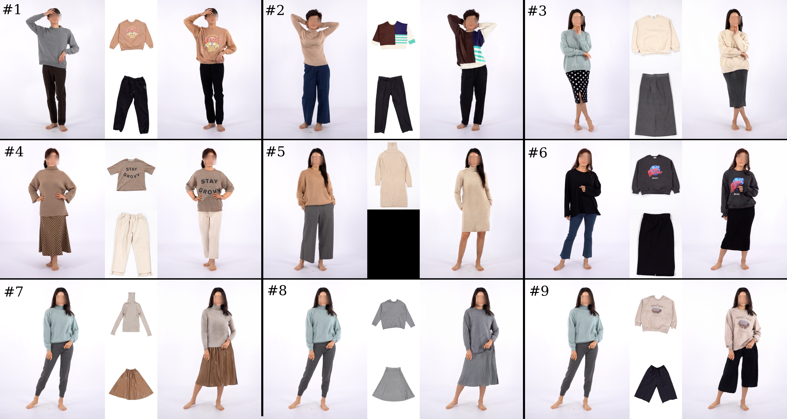
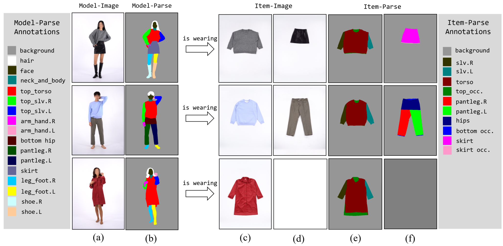

# *Release History*
24.12.27. WGF-VITON version 1.0 is now available.

# Full-body Virtual Try-On using Top and Bottom Garments with Wearing Style Control
Official implementation for "_Full-body Virtual Try-On using Top and Bottom Garments with Wearing Style Control_" published in _Computer Vision and Image Understanding_ in 2024.

* Author: Soonchan Park and Jinah Park
* Paper link: (TBD)
* Supplementary material: (TBD)



## Dataset : Fashion-TB


Fashion-TB dataset consists of 37,492 wearing pairs between garments and fasion model.
The fashion model can has multiple indices to point top and bottom garments what he/she is wearing. In dress case, such a model has only one index for top garment.

* You can download from the link: (TBD)

## Installation 
The project have been tested with the following environment:
* PyTorch 1.13.1
* Torchvision 0.13.1
* Python 3.8
* CUDA 11.6

### Docker
The folder "docker" has Dockerfile to set docker images for running WGF-VITON.
```
cd docker
docker build . -t {docker_image_name}
```

### Anaconda
```
conda create -n {name} python=3.8 anaconda
conda activate {name}
conda install pytorch torchvision torchaudio pytorch-cuda=11.6 -c pytorch -c nvidia
pip install cupy
```

## Downloads
You can download dataset and pre-trained model via links below. Please note license policy of this work. 

* pre-trained model of WGF-VITON and Fashion-TB: https://drive.google.com/drive/folders/12PoisAUqyyA4AOWjXMdFJlR4OrI9DrcO?usp=sharing
* released version of WGF-VITON has 6.72 FID in the unpaired dataset. It is achieved by a longer training without any modification.

## Training
```python
CUDA_VISIBLE_DEVICES=0,1 python train.py --dataroot {data_path} --gpu_ids 0,1 --batch-size 4 --name {project_name} --workers 6 --keep_step 100000 --decay_step 100000 --shuffle --fine_height 512 --fine_width 384 --num_D 2 --lr_D 0.0002
```

## Testing
```python
CUDA_VISIBLE_DEVICES=2 python test.py --name {project_name} --batch-size 8 --workers 1 --checkpoint {checkpoint_path}/step_G_200000.pth --wearing test_unpair_mild.json --dataroot {data_path} --gpu_ids 0
```

After inference dataset using the command above, you can evaluate the results in FID (https://github.com/mseitzer/pytorch-fid)

## License

All material is made available under [Creative Commons BY-NC 4.0](https://creativecommons.org/licenses/by-nc/4.0/). You can **use, redistribute, and adapt** the material for **non-commercial purposes**, as long as you give appropriate credit by **citing our paper** and **indicate any changes** that you've made.

## Citation

```
@article{park2024full,
  title={Full-body Virtual Try-on using Top and Bottom Garments with Wearing Style Control},
  author={Park, Soonchan and Park, Jinah},
  journal={Computer Vision and Image Understanding},
  year={2024}
}
```

## Acknoledgements
We implemente the code for WGF-VITON based on PyTorch implementation of [CP-VTON](https://github.com/sergeywong/cp-vton), [SPADE](https://github.com/NVlabs/SPADE), and [HR-VITON](https://github.com/sangyun884/HR-VITON).
